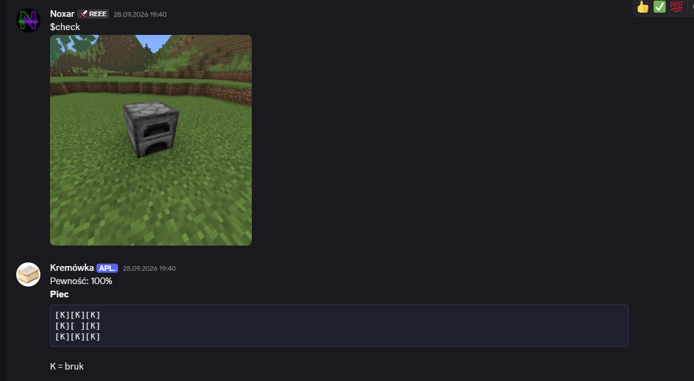

#  Kremówka – bot z przepisami do Minecrafta

Bot Discord, który rozpoznaje przedmioty z Minecrafta ze screenów i wysyła przepisy na crafting ⛏️

##  Opis

Masz w grze przedmiot i nie wiesz, jak go zrobić? Wyślij botowi screena! Bot używa modelu AI wytrenowanego w Google Teachable Machine. Model rozpoznaje przedmiot na obrazku, a bot wysyła przepis prosto na Discorda.

Model rozpoznaje 5 przedmiotów:
- Kowadło
- Piec
- Stół rzemieślniczy
- Skrzynia
- Łóżko

##  Jak to działa

1. Użytkownik wysyła screena z komendą `$check`
2. Bot zapisuje obrazek
3. Model sprawdza, co jest na obrazku, i zwraca nazwę przedmiotu oraz pewność
4. Jeśli model jest pewny na ponad 60%, bot wysyła przepis 📜
5. Jeśli nie, bot prosi o wyraźniejszy screen
6. Jeśli plik ma zły format albo jest uszkodzony, bot o tym informuje ⚠️

##  Komendy

| Komenda | Co robi |
|---|---|
| `$check` + screen | rozpoznaje przedmiot i wysyła przepis |
| `$craft kowadło` | wysyła przepis po nazwie |
| `$craft` | pokazuje listę przedmiotów |
| `$hello` | przywitanie |

##  Bot w akcji

##  Technologie

- Python
- discord.py
- TensorFlow i tf-keras
- Google Teachable Machine
- Pillow i NumPy

##  Jak uruchomić

1. Pobierz repozytorium
2. Zainstaluj biblioteki: `pip install discord.py tensorflow tf-keras pillow numpy`
3. Włącz **Message Content Intent** w Discord Developer Portal
4. Utwórz plik `config.py` i wpisz w nim: `TOKEN = "twoj_token"`
5. Uruchom bota: `python main.py`

##  Plany

- więcej przedmiotów
- klasa „Inne”, żeby bot nie zgadywał na siłę
- przepisy jako obrazki

##  Licencja

Projekt jest na licencji MIT.
